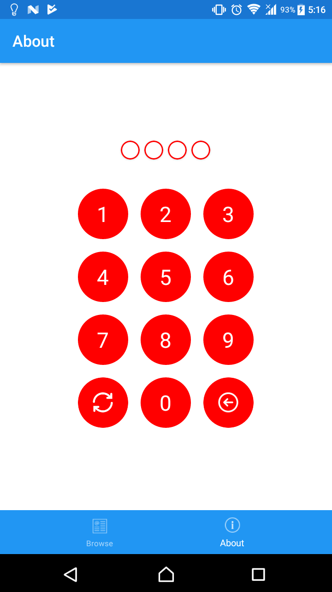

# SkorXam.Pin
PinView for Xamarin.Forms
### Installation
Nuget: [SkorXam.Pin](https://www.nuget.org/packages/SkorXam.Pin/)
### Usage
```xml
<?xml version="1.0" encoding="utf-8" ?>
<ContentPage ...
             xmlns:pin="clr-namespace:SkorXam.Pin;assembly=SkorXam.Pin"
             ...>
    ...
    
    <pin:PinView VerticalOptions="FillAndExpand"
                 HorizontalOptions="Fill"
                 ButtonColor="Azure"
                 PinChanged="PinView_PinChanged"
                 PinSubmitCommand="{Binding PinSubmit}"
                 Pin="{Binding Pin}"
                 ButtonTextColor="Red"/>
</ContentPage>

```

#### Reference 
It dependent to: [Plugin.CrossPlatformTintedImage](https://github.com/shrutinambiar/xamarin-forms-tinted-image)

#### Demo


### Properties
```csharp
 - Spacing: Spacing from dots to keyboard
 - DotSpacing: Spacing between dots
 - PinLength: ...
 - DotColor: ...
 - DotSize: ...
 - DotEmptyColor: Dot's color when unfill
 - DotBorderColor: (New)
 - PinSubmitCommand: Command raise when full fill dots
 - Pin: Pin value
 - ButtonSize: Size of buttons 1-9, clear and backspace
 - ButtonCornerRadius: Button corner radius (New)
 - ButtonColor: Color of buttons 1-9, clear and backspace
 - ButtonTextColor: TextColor of buttons 1-9
 - ClearButtonImageSource: ImageSource for Clear button (New)
 - DeleteButtonImageSource: ImageSource for Backspace button (New)
```

### Events
```csharp
 - PinChanged : Raise when Pin has changed
 - PinSubmit: Raise when full fill pin
```
##### Note: If you have any issue with this package, feel free to create issue on this repository.